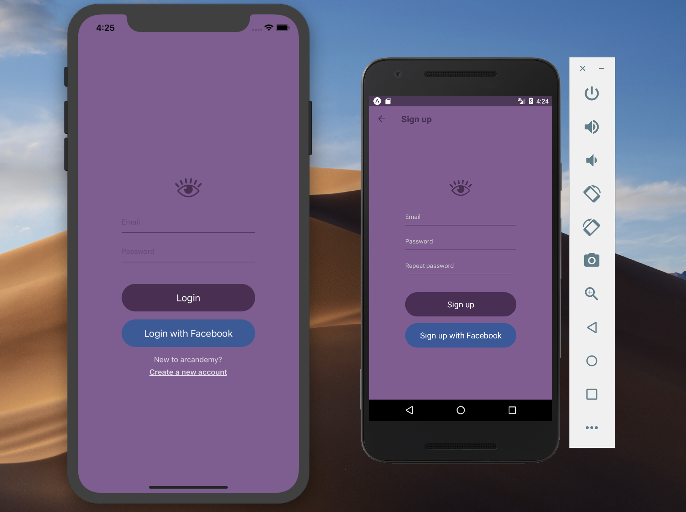
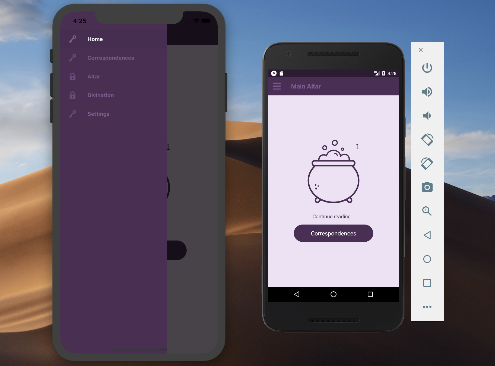

# Arcandemy 101 🧙
This is the repository for my personal project - React Native app for witches. I create it for those who want to
learn the basics of witchcraft. ✨🔮 Go and checkout my [witchy instagram](https://www.instagram.com/arcandemy/).

## Technical information
Basic tools:
* React Native
* React Navigation
* Redux
* Firebase

## Progress
### Done
✔️ Created basic components (Button, TextInput, Link) and modules (auth, home).  
✔️ Added Login and Signup scenes for auth module.  
✔️ Added react-navigation (navigator module).  
✔️ Added Chapter and Page scenes in chapters module.  
✔️ Styled App Drawer.  
✔️ Added Firebase login, registration and add Redux actions (login, logout, register).  
✔️ Added AsyncStorage.  
✔️ Added List of Pages for Chapters and pass info from JSON file  
✔️ Added User object in Firebase database  
✔️ Added Chapters logic (block next Chapter unless current is finished and change Main Altar image with every new Chapter).  
✔️ Create Navigator dynamically for Chapters.  
✔️ Add animations.  
✔️ Add helpers for Pages to render JSON page content.  
✔️ Add user's Chapter progress in Firebase - updates on many devices and updates after wifi connection loss.  
✔️ Add field validation in auth module (for password in Sign Up).  
✔️ Send e-mail verification after registration.  

### TODO
* Add Facebook login and signup.
* Add Forgot Password scene in auth module.

## Current views
   

The picture on the main screen changes with user's progress (new items are added to the cauldron).
To access the next Chapter user has to finish reading the current Chapter (blocked Chapters have a locker in the Drawer Menu while unlocked ones are marked with a key).  
  
  
  
