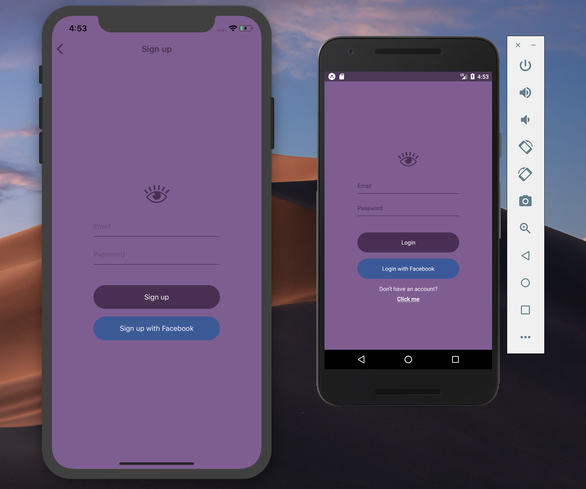
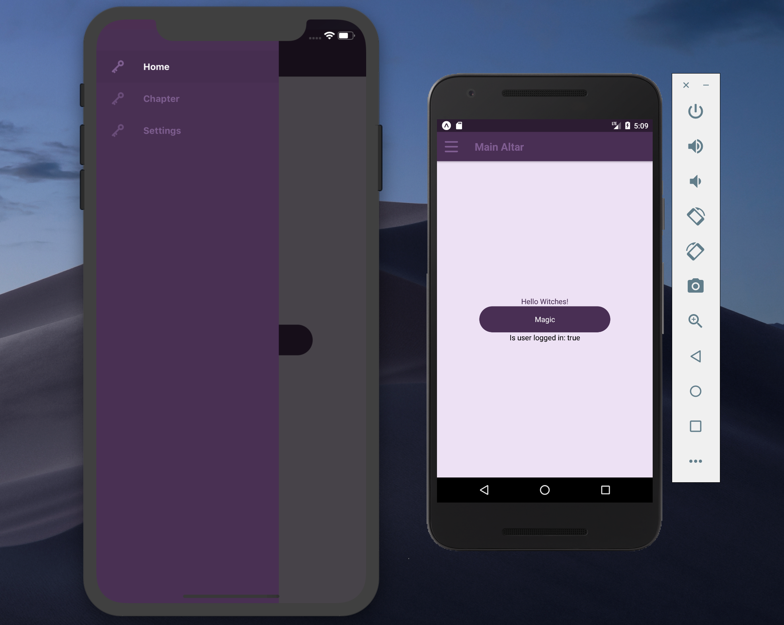
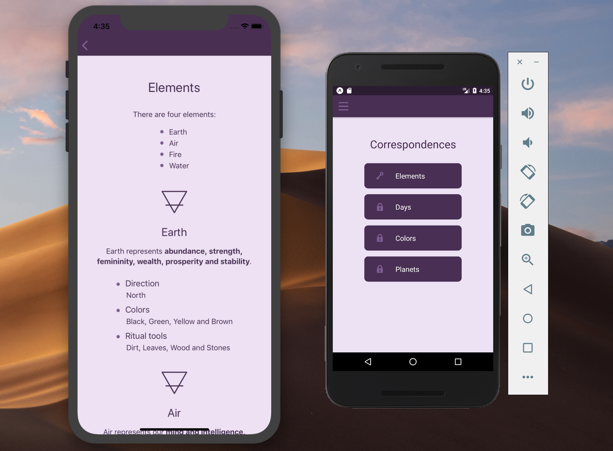
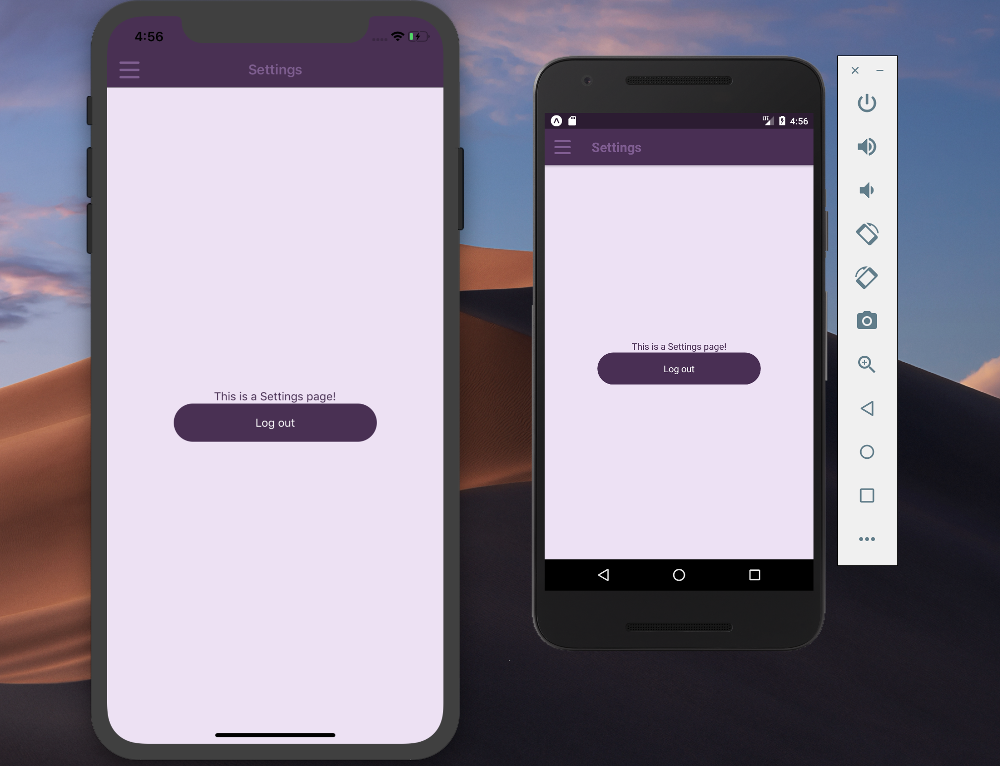

# Arcandemy 101 🧙
This is the repository for my personal project - React Native app for witches. I create it for those who want to
learn the basics of witchcraft. ✨🔮 Go and checkout my [witchy instagram](https://www.instagram.com/arcandemy/).

## Technical information
Basic tools:
* React Native
* React Navigation
* Redux
* Firebase

## Progress
### Done
✔️ Created basic components (Button, TextInput, Link) and modules (auth, home).  
✔️ Added Login and Signup scenes for auth module.  
✔️ Added react-navigation (navigator module).  
✔️ Added Chapter and Page scenes in chapters module.  
✔️ Style App Drawer.  

### TODO
* Add Firebase registration and add Redux.
* Add field verification.
* Create Navigator dynamically for Chapters.
* [Render HTML in Pages](https://stackoverflow.com/questions/29334984/render-html-in-react-native).
* Add Chapters logic (block next Chapter unless current is finished and change Main Altar image).
* Add Forgot Password scene in auth module.

## Current views
  
  
  
  
